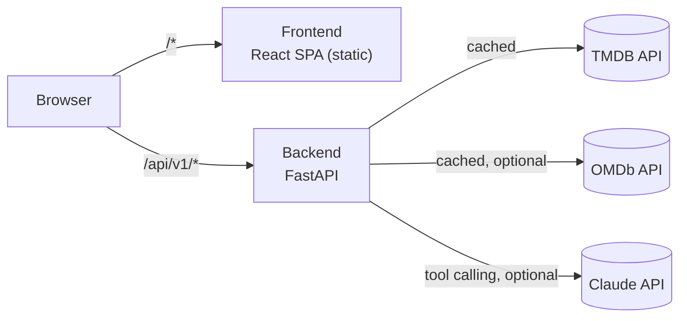

# 🎬 MyMoviesApp

A streaming-style explorer for movies, TV shows and people, built on the TMDB API: see what's trending, filter by genre and by the services you can actually watch in your country, open trailers, check awards and critic scores, and ask an AI assistant what to watch tonight.

**Live demo → [movies-app-swart-xi.vercel.app](https://movies-app-swart-xi.vercel.app)**


## ✨ Features

- **Ask AI what to watch.** Describe a mood, a plot or a title you loved ("a short comedy on Netflix", "like Interstellar") and refine it in a chat ("more recent ones"). A Claude agent searches the catalog with the app's own API as tools, shows each step as it works, and only recommends real titles, each with why it fits and where to stream it in your country. It opens over any page from the navbar, the search box or the home page.
- **Browse like a streaming service.** Home rows for what's in theaters, coming soon, popular and top rated; plus Movies and TV Shows pages filtered by genre, sorted by popularity, rating or release date, and shareable through the URL.
- **Where to watch, in your country.** The country is detected from the browser language (and can be changed with a flag picker). It drives the streaming, rent and buy options on each title, the "Streaming in…" filter (e.g. *comedies on Netflix in Colombia*) and local release dates. The logos of the main services (Netflix, Prime Video, Apple TV, Google Play, YouTube…) open a search for the title on that service.
- **Hover previews.** Resting the mouse on a poster grows it into a card with the backdrop, rating, runtime, genres, synopsis and a trailer button (pointer devices only).
- **Seasons and episodes** for every show, starting from the latest season on air, plus the next scheduled episode.
- **Directors, creators and sagas**: who made each title, directors' and writers' filmographies, and every movie of a saga in release order.
- **Release calendar**: what opens in theaters or at home each month in your country, and new series premiering.
- **Trailers** in a modal player, from the home spotlight, the previews and every detail page.
- **Awards and critic scores**: IMDb, Rotten Tomatoes and Metacritic, plus the awards summary ("Won 4 Oscars…").
- **Live search** across movies, TV shows and people, with suggestions and keyboard navigation.
- **Link previews**: sharing a movie, show or person on WhatsApp, Telegram, Discord… shows a card with its image, title and synopsis.
- **Mobile first**: collapsible search, touch-friendly dropdowns, no horizontal overflow.

<table>
  <tr>
    <td width="50%"><br><sub>Hover preview</sub></td>
    <td width="50%"><br><sub>Detail page: scores, awards and where to watch</sub></td>
  </tr>
  <tr>
    <td width="50%"><br><sub>Browse: comedies streaming on Netflix</sub></td>
    <td width="50%">
      
      <br><sub>Mobile</sub>
    </td>
  </tr>
</table>

## 🛠️ Tech stack

| | |
|---|---|
| **Frontend** | React 19, TypeScript, Vite 6, Tailwind CSS 4, TanStack Query, React Router 7 |
| **Backend** | Python 3.12, FastAPI, httpx (async client with retries and a TTL cache), pydantic-settings |
| **Data** | [TMDB](https://www.themoviedb.org/) (titles, people, images, trailers; streaming data by JustWatch) and [OMDb](https://www.omdbapi.com/) (awards and critic scores) |
| **AI** | Claude Haiku 4.5 through the Anthropic Python SDK: a hand-written tool-calling loop, answers streamed as Server-Sent Events |
| **Testing** | Vitest + Testing Library, pytest + respx (no network in tests) |
| **Hosting** | Vercel (static frontend + FastAPI function in one project) |
| **Tooling** | GitHub Actions (lint, tests, dependency audit, Docker build), semantic-versioned releases; Docker + nginx for local production-like runs |

## 🏗️ Architecture



The browser only talks to this app: the frontend and the API share one domain, and the API keys never leave the backend. The backend normalises TMDB's movie/TV differences into one API and caches responses in memory. The same layout runs on Vercel (`vercel.json`) and locally with Docker (`docker-compose.yml`, nginx in front).

The AI assistant is an agent loop in the backend (`backend/app/services/assistant.py`): Claude gets the request plus tools that wrap the backend's own TMDB services (discover with filters, search, similar titles, where to watch), calls them as needed and finishes with a structured list of picks, which the backend only accepts if a tool returned them. Follow-ups resend a compact recap of the conversation, since the model has no memory. Its cost is kept in check with per-visitor and site-wide limits, a cache for repeated questions and a small, fast model.

Security basics are in place on both: a Content Security Policy and related headers, per-IP rate limiting on the API, validated inputs and no secrets in the client or in the repo.

## 🚀 Running locally

**Requirements:** Python 3.12, Node 22, a free [TMDB API key](https://www.themoviedb.org/settings/api) and, optionally, a free [OMDb API key](https://www.omdbapi.com/apikey.aspx) and an [Anthropic API key](https://platform.claude.com) (pay as you go) for the AI assistant.

1. Create `backend/.env`:

   | Variable | Required | Purpose |
   |---|---|---|
   | `THE_MOVIE_DB_API_KEY` | yes | TMDB API key |
   | `OMDB_API_KEY` | no | Awards and critic scores; hidden without it |
   | `ANTHROPIC_API_KEY` | no | The "Ask AI" assistant; without it `/api/v1/ask` answers 503. Each question costs about 1–2 cents |
   | `CORS_ORIGINS` | no | Frontend origins allowed to call the API; the default covers `npm run dev` (:5173) and Docker (:3000) |

2. Start the backend (http://localhost:8000, docs at `/docs`):

   ```bash
   cd backend
   python -m venv myvenv && source myvenv/bin/activate
   pip install -r requirements-dev.txt
   uvicorn app.main:app --reload
   ```

3. Start the frontend (http://localhost:5173):

   ```bash
   cd frontend
   npm install
   npm run dev
   ```

`./start.sh` runs both. To try the production setup instead, run `docker compose up --build` and open http://localhost:3000.

## ✅ Tests and checks

```bash
# backend/
ruff check . && pytest -q

# frontend/
npm run lint && npm test && npm run build
```

Every pull request runs all of the above plus a dependency audit and a Docker build.

## 📦 Deployment

Vercel deploys `main` to production and every other branch to a private preview. The project needs `THE_MOVIE_DB_API_KEY` (and optionally `OMDB_API_KEY` and `ANTHROPIC_API_KEY`) as environment variables, plus one Firewall rate-limit rule for `/api/`. Merging into `main` also tags a semantic version and publishes a GitHub release.

## 🗺️ Roadmap

- **Accounts (optional):** sign in with Google to keep favourites and "My list" across devices.
- **Evals for the AI assistant:** a set of requests with expected results, scored automatically in CI.
- **Personal recommendations:** a taste profile from favourites and 👍/👎 on the assistant's picks, and similar titles by embeddings.

## 🙏 Credits

This product uses the TMDB API but is not endorsed or certified by TMDB. Streaming availability is provided by JustWatch through TMDB, awards and scores come from OMDb, and the assistant's suggestions are generated by Claude and can be wrong. Posters, backdrops and trailers belong to their respective owners.


